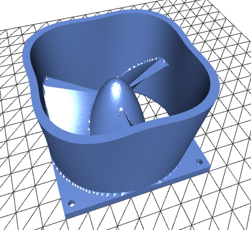

## Update - 30th June 2024

- some optimizations to speed up

## Update - 22nd June 2024

- **Triangle Lookup Table implemented** - no defective surfaces anymore

- **nearly all functions compiled with _Numba_** - faster operation 

## Update - 27th November 2022

A new, much faster version is available. It uses more numba jit compiled python code and more parallelization.

The first run may be slower due to compilation time. 




# xyzCad - functional cad software

xyzCad is an ease to use marching cubes based cad software generating 3d printable stl files from a function f(x, y, z) = {True : False}.

x, y and z are the coordinates in 3d space in mm. The function f(x, y, z) returns True or False depending on the arguments x, y and z. True means, there should be solid. False means, there is nothing.

## Theory of operation

It looks like the software iterates over alle points in the 3d raster space. But this would be very slow. So the algorithm is a bit more optimized.

1. At first it searches for two points, one inside the solid (=True), one outside (=False).

2. Now the surface is searched on a line between the two points.

3. Rasterization is done over the surface only.

That means only one solid can be created. If two solids without contact to each other are created, only the one found at first will be rendered.

## Usage example

Let us create a sphere:

```python

#!/usr/bin/env python3

from numba import njit
from xyzcad import render

@njit
def f(x,y,z):
    r = 10
    return r**2 > x**2 + y**2 + z**2

render.renderAndSave(f, 'sphere.stl', 0.3)
```

numba just in time compiler makes it a bit faster. render is the xyzcad renderer/compiler. We want a resolution of ``0.3`` mm. The output file should be ``sphere.stl``. Our sphere will have a radius of ``r = 10`` mm. 

## Want to Support the project?

Buy your 3d printer filament or parts using my affiliate link:

[Amazon](https://amzn.to/3cj8bTB)

[eBay](https://ebay.us/JyX6h0)


